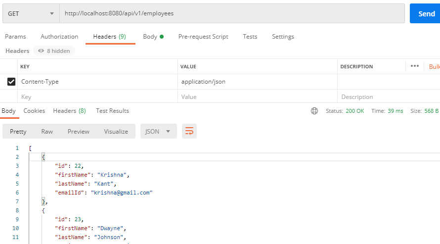
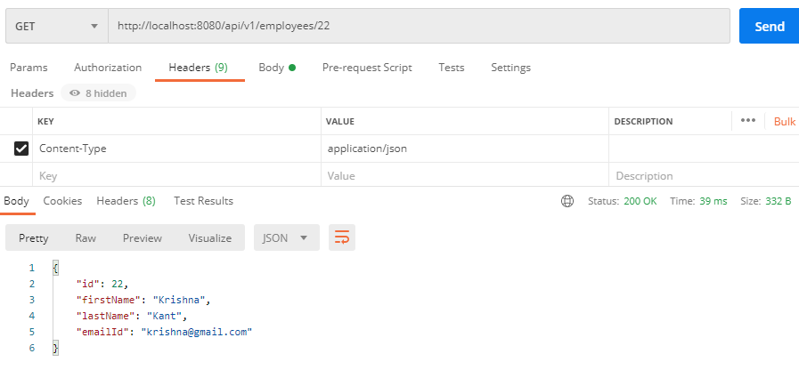
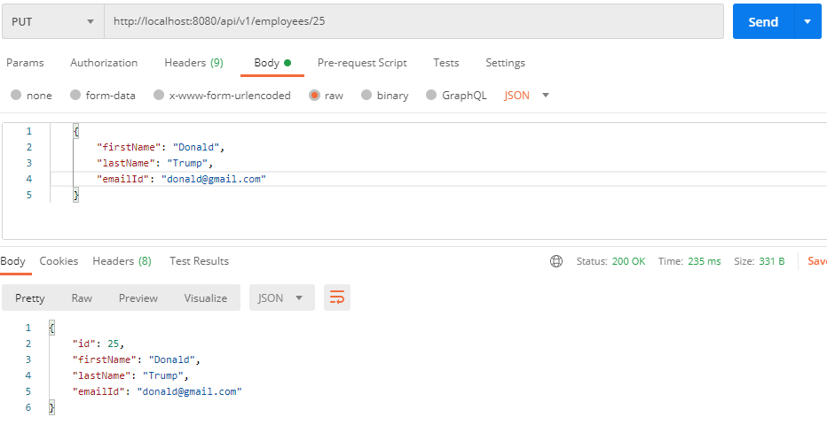
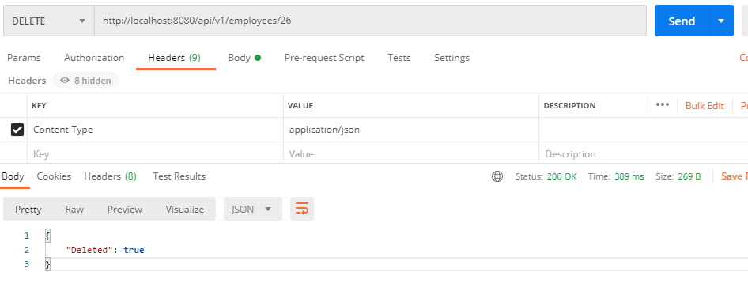

# employee-management-system-backend

employee-management-system-backend in spring boot

# rest apis

## get all employees

## create employee

## get employee by Id

## update employee

## delete employee

